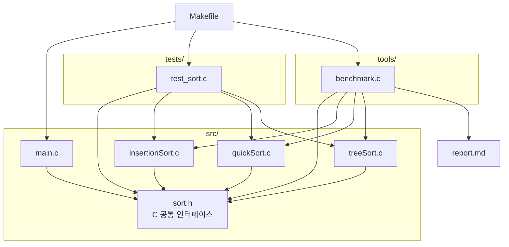
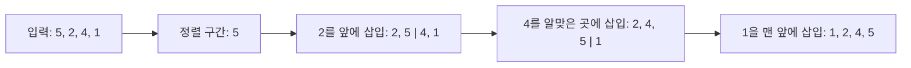
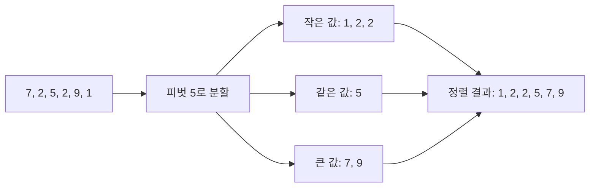
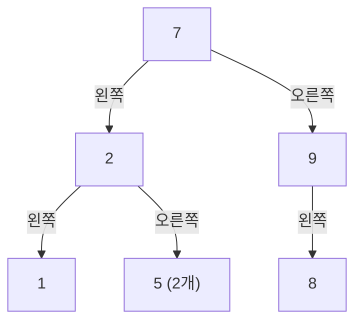
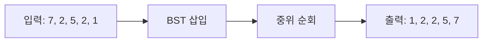
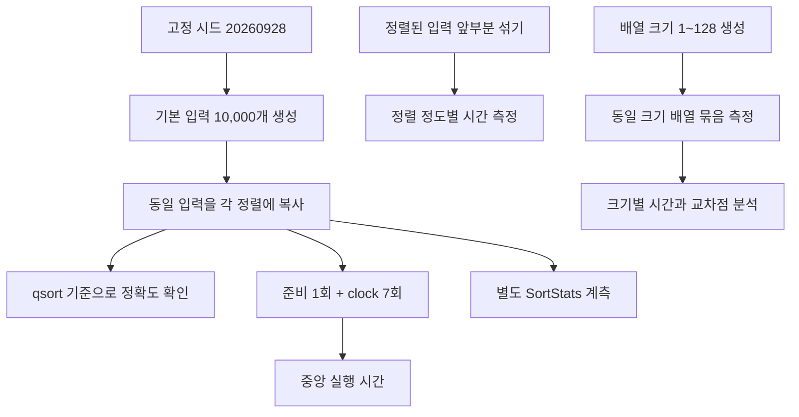
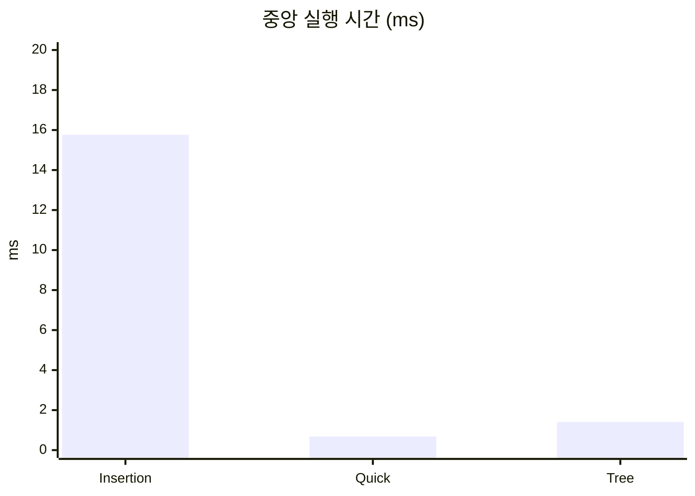
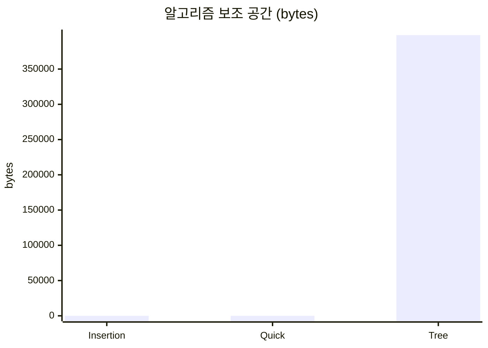
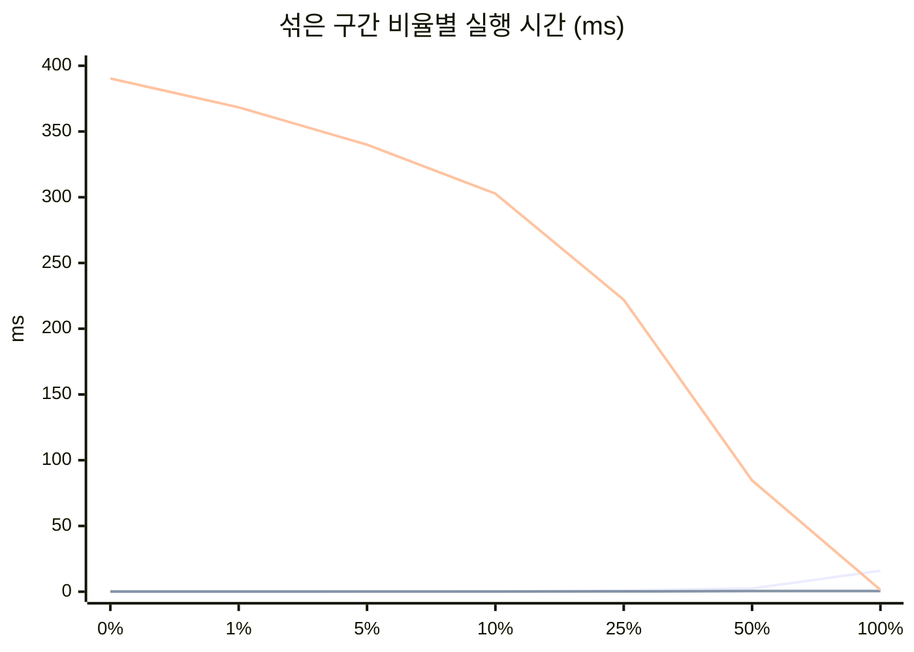
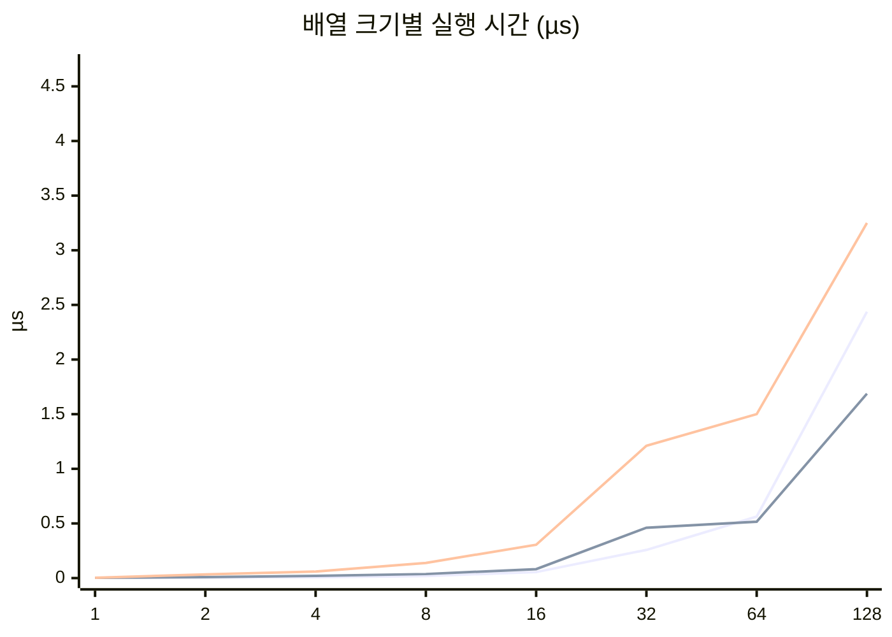

# 정렬 비교 보고서 - 삽입 · 버블 · 트리
세 가지 정렬을 **하나의 공통 인터페이스**로 묶고, 같은 잣대로 속도, 보조 메모리, 안정성, 비교 횟수, 입력 정렬 정도별 성능 등을 비교한 결과이다.

- 구현: [`src/insertionSort.c`](../src/insertionSort.c) ·
  [`src/quickSort.c`](../src/quickSort.c) · [`src/tree_sort.c`](../src/tree_sort.c)
- 실행: `make run` (비교 표) · `make test` (유닛 테스트 42개)
- 환경: 컨테이너 안 `gcc -std=c17 -Wall -Wextra -O2`

## 차례

1. [코드 보고서](#1-코드-보고서) - 무엇을 어떻게 만들었나
2. [알고리즘 상세](#2-알고리즘-상세) - 세 정렬이 실제로 어떻게 행동하는가
3. [알고리즘 실험](#3-알고리즘-실험) - 같은 잣대로 비교한 결과

## 1. 코드 보고서

### 1.1 설계 선택과 근거

삽입·퀵·tree sort를 C17로 구현해 같은 입력과 측정 조건에서 시간복잡도·비교 및 이동 횟수·보조 공간·재귀 깊이를 비교한다. 세 함수는 공통 인터페이스로 정수 배열을 제자리 오름차순 정렬한다. 외부 라이브러리 없이 표준 C 라이브러리만 사용해 실습 환경에서 바로 빌드하고 실행할 수 있게 했다.

### 1.2 인터페이스 설계

인터페이스를 먼저 정한 이유는 **정렬 알고리즘의 차이만 공정하게 비교**하기 위해서이다. 세 알고리즘이 서로 다른 방식으로 입력을 받거나 결과를 내면 실행·테스트·측정 코드도 각자 달라져 비교 기준이 흔들릴 수 있다.
그래서 sort.h에서 함수 형식, 제자리 오름차순 정렬, 통계 전달 방식을 통일했다. 그러면,
1) 같은 입력을 같은 절차로 각각 실행할 수 있다
2) 알고리즘을 바꿔도 테스트와 벤치마크 코드를 거의 바꾸지 않아도 된다.

**인터페이스 설계에서 선택한 것**

| 선택한 것 | 선택 이유 |
| --- | --- |
| `typedef void (*SortFunction)(int a[], int n, SortStats *stats)` | 세 정렬을 같은 함수 포인터 형식으로 호출해 실행 예제·테스트·벤치마크에서 알고리즘별 어댑터가 필요 없게 한다. |
| 입력 배열을 오름차순으로 제자리 정렬하고 반환값은 두지 않음 | 별도 결과 배열을 만들지 않아도 되고, 출력 계약을 모든 구현에서 동일하게 유지한다. |
| `SortStats *`를 선택 인자로 전달하고 `NULL`을 허용 | 통계가 필요한 실행에서는 비교·이동·보조 공간·재귀 깊이를 기록하고, 시간 측정에서는 계측 비용을 끌 수 있다. |
| `SortFunction` 함수 포인터로 공통 타입 정의 | 정렬 함수들을 배열에 담아 같은 입력·검사·측정 절차로 반복 실행할 수 있다. |
| 길이 `n`을 호출자가 전달 | 포인터와 배열 길이를 명시해 빈 배열도 `n = 0`으로 처리하고, 구현이 길이를 추정하지 않게 한다. |


### 1.3 파일 구성



| 파일 | 기능 |
| --- | --- |
| `Makefile` | C 프로그램 빌드·실행·테스트·보고서 생성 |
| `report.md` | 정렬 알고리즘 설명과 C 실험 결과 |
| `src/sort.h` | C 정렬 함수와 통계 구조체의 공통 인터페이스 |
| `src/insertionSort.c` | C 삽입 정렬 구현 |
| `src/quickSort.c` | C 퀵 정렬 구현 |
| `src/treeSort.c` | 이진 탐색 트리를 만들고 중위 순회로 정렬하는 tree sort |
| `src/main.c` | 정렬 실행 예제와 통계 출력 |
| `tools/benchmark.c` | C 정렬 성능 측정 및 `report.md` 생성 |
| `tests/test_sort.c` | 표준 C로 정렬 결과와 통계 검증 |

### 1.4 검증 방법

```console
$ make test
```

1. **빌드·링크**: `make test`가 `tests/test_sort.c`와 세 정렬 구현을 빌드한 뒤 테스트를 실행한다.
2. **정렬 결과**: 섞임·정렬됨·역순·중복·원소 하나·빈 배열을 세 알고리즘에 적용해 총 18개 결과를 비교한다.
3. **통계 기록**: 세 정렬에 `{3, 1, 2}`를 넣어 정렬 결과와 비교·이동·보조 공간 카운터 기록 여부를 확인한다.
4. **벤치마크 정답**: 10,000개 입력을 `qsort` 결과와 대조하며, 불일치하면 보고서 생성을 중단한다.
5. **시간 측정**: 준비 실행 후 복사를 제외하고 7회 재며, 중앙값을 사용한다. 연산·공간 통계는 별도로 잰다.
6. **안정성**: 레코드 순서를 직접 시험하지 않고, 같은 값의 순서를 보존하는지 구현의 동률 처리로 판별한다.
7. **변이 테스트**: 실제 코드는 그대로 두고 `/tmp` 복사본에 결함을 넣어 테스트가 검출하는지 확인했다.

| 망가뜨린 곳 | 결과 |
| --- | --- |
| Tree sort에서 중복 원소 개수 증가 제거 | 중복 입력 검사 실패 (21개 중 1개, 종료 코드 1) |
| Tree sort에서 오른쪽 하위 트리 순회 생략 | 통계·섞인 배열·중복 입력 검사 실패 (21개 중 3개, 종료 코드 1) |

## 2. 알고리즘 상세

### 2.1 삽입 정렬 (Insertion sort)

왼쪽의 정렬된 구간을 유지하면서 다음 원소를 꺼내, 그보다 큰 원소를 오른쪽으로 옮긴 뒤 빈자리에 삽입한다. 거의 정렬됐거나 원소 수가 적으면 빠르지만, 역순에 가까운 입력에서는 이동이 많아진다. 최선은 O(n), 평균·최악은 O(n²)이며 제자리에서 안정적으로 정렬한다.

핵심은 현재 값을 보관하고, 그보다 큰 앞쪽 원소만 오른쪽으로 밀어 빈자리에 삽입하는 것이다.

```c
int value = a[i];
int j = i - 1;
while (j >= 0 && a[j] > value) {
    a[j + 1] = a[j];
    j--;
}
a[j + 1] = value;
```

`>` 조건은 같은 값은 지나치지 않으므로 입력 순서를 유지한다.



### 2.2 퀵 정렬 (Quick sort)

피벗을 기준으로 작은 값·같은 값·큰 값의 세 구간으로 분할한 뒤, 작은 값과 큰 값 구간을 재귀적으로 정렬한다. 평균은 O(n log n)이지만 분할이 한쪽으로 치우치면 최악 O(n²)이다. 가운데 원소를 피벗으로 사용하는 이 구현은 제자리 분할을 하지만 안정성은 보장하지 않는다.

`less`, `scan`, `greater` 경계로 작은 값·미확인 값·큰 값을 나누며 한 번의 순회로 피벗 기준 세 구간을 만든다.

```c
while (scan <= greater) {
    if (a[scan] < pivot) {
        int tmp = a[less];
        a[less++] = a[scan];
        a[scan++] = tmp;
    } else if (a[scan] > pivot) {
        int tmp = a[greater];
        a[greater--] = a[scan];
        a[scan] = tmp;
    } else {
        scan++;
    }
}
```

작은 값은 왼쪽으로, 큰 값은 오른쪽으로 보낸다. 큰 값과 바꿔 온 원소는 아직 확인하지 않았으므로 `scan`을 그대로 둔다.



### 2.3 트리 정렬 (Tree sort)
트리 정렬의 내용은 AI(chatGPT)를 사용해서 학습하였다. 아래 내용은 트리 정렬에 대해서 학습한 내용이다.

입력 원소를 이진 탐색 트리에 삽입한 뒤, 중위 순회(left → node → right) 결과를 배열에 다시 써 오름차순으로 만든다. 이 구현은 반복형 삽입과 반복형 순회를 사용해 트리가 한쪽으로 기울어도 호출 스택이 깊어지지 않게 한다. 같은 정수는 새 노드를 만들지 않고 해당 노드의 `occurrences`를 증가시킨다.

#### 선수 개념: 이진 탐색 트리란
이진 탐색 트리는 각 노드가 값과 왼쪽·오른쪽 자식을 갖는 구조다. 왼쪽 하위 트리에는 노드보다 작은 값, 오른쪽 하위 트리에는 큰 값을 둔다. 같은 값은 새 노드 대신 기존 노드의 `occurrences`에 센다.

예를 들어 `7, 2, 9, 1, 5, 8, 5`를 차례로 삽입하면 다음 구조가 된다. 두 번째 5는 새 노드를 만들지 않고 기존 5의 개수에 합친다.



#### 1단계: 이진 탐색 트리 구성

각 값은 현재 노드보다 작으면 왼쪽, 크면 오른쪽으로 내려간다. 같은 값이면 개수만 늘린다. 노드를 만들 때까지 이 과정을 반복한다.

```c
while (*link != NULL) {
    if (value < (*link)->value) link = &(*link)->left;
    else if (value > (*link)->value) link = &(*link)->right;
    else { (*link)->occurrences++; break; }
}
```

노드 삽입 순서에 따라 트리 모양이 달라진다. 균형이 잘 맞으면 각 삽입이 짧은 경로를 따라가지만, 이미 정렬된 입력은 계속 같은 방향의 자식으로만 연결돼 긴 사슬이 될 수 있다.

#### 2단계: 반복형 중위 순회

스택에 왼쪽 경로를 저장했다가 가장 작은 노드부터 꺼낸다. 노드를 꺼낼 때 `occurrences`만큼 값을 출력 배열에 기록하고, 오른쪽 하위 트리로 이동한다.

```c
while (current != NULL || stack_size > 0) {
    while (current != NULL) {
        stack[stack_size++] = current;
        current = current->left;
    }
    current = stack[--stack_size];
    writeValue(current->value, current->occurrences);
    current = current->right;
}
```

`writeValue`는 동작을 보여 주기 위한 축약 표현이며, 실제 구현은 반복문으로 해당 값을 `occurrences`번 배열에 쓴다. 트리 구성이 끝날 때까지 원본 배열을 수정하지 않으므로 노드나 스택 할당에 실패하면 입력은 그대로 남는다.

#### 복잡도·공간·안정성

노드 삽입 비용은 트리 높이를 `h`라 할 때 O(nh), 중위 순회는 O(n)이다. 균형 트리에서는 높이가 O(log n)이므로 평균적인 시간은 O(n log n)이지만, 입력 순서가 오름차순 또는 내림차순이면 높이가 O(n)이 되어 최악 시간은 O(n²)이다. 노드와 순회 스택을 저장하므로 추가 공간은 O(n)이다. 중복을 개수로 합치고 원래 순서는 저장하지 않으므로 안정 정렬은 아니다.



## 3. 알고리즘 실험

같은 C 구현을 같은 고정 입력과 측정 절차로 비교했다. 실행 시간, 연산 횟수, 보조 공간, 재귀 깊이를 표와 그래프로 나타낸다.

### 3.1 실험 설계

모든 구현은 컨테이너의 `gcc -std=c17 -Wall -Wextra -O2` 환경에서 측정했다.

| 무엇을 재는가 | 방법 | 주의사항 |
| --- | --- | --- |
| 기본 실행 시간 | 고정 시드 `20260928`로 만든 같은 정수 10,000개를 사용한다. 준비 1회 후 `clock()`으로 7회 재고 중앙값을 낸다. | 입력 복사와 정답 확인은 시간에서 제외한다. 한 컴파일러·환경에서 얻은 값이다. |
| 정렬 정확도 | `qsort` 결과를 기준 배열로 삼아 계측·준비·시간 측정 실행 결과를 대조한다. | 확인 비용은 실행 시간에 포함하지 않으며, 불일치하면 보고서 생성을 중단한다. |
| 비교·이동 횟수 | 별도 실행에서 `SortStats` 카운터를 읽는다. | 구현이 정한 연산 단위의 카운트이며 실제 CPU 명령 수는 아니다. |
| 보조 메모리 | 각 구현이 `SortStats.auxiliary_bytes`에 기록한 값을 읽는다. | 입력 배열과 호출 스택은 제외한다. Tree sort의 노드와 순회 스택은 포함한다. |
| 재귀 깊이 | 별도 계측 실행에서 `max_recursion_depth`를 읽는다. | 재귀 호출 깊이만 뜻한다. 반복형 Tree sort에서는 트리 높이를 나타내지 않는다. |
| 입력 정렬 정도별 시간 | 10,000개 오름차순 값에서 앞부분의 0·1·5·10·25·50·100%만 Fisher–Yates로 섞어 7회 측정한다. | 나머지 뒷부분은 정렬 상태다. 임의의 전체 배열 교란과는 다른 입력 모델이다. |
| 작은 배열 시간·교차점 | 무작위 배열 크기 1~128을 모두 측정하고, 같은 크기의 여러 배열을 묶어 배열당 중앙 시간을 낸다. | 교차점은 인접 크기 최대 5개의 중앙값으로 평활화하고, 5개 연속 크기 우세를 기준으로 한다. |
| 안정성 | 같은 키에서 원래 순서를 보존하는지 구현의 동률 처리로 판별한다. | 정수 전용 테스트라 꼬리표가 있는 레코드로 직접 측정하지 않는다. |

#### 안정성을 어떻게 판별했는

안정 정렬은 정렬 키가 같은 항목들의 입력 순서를 정렬 후에도 보존한다. 직접 시험할 때는 같은 키의 항목에 입력 순서를 나타내는 꼬리표를 붙인다. 예를 들어 `[(2,A), (1,X), (2,B)]`를 첫 값 기준으로 정렬했을 때 `A`가 `B`보다 앞에 있으면 안정이다. 이번 테스트 인터페이스는 정수만 받으므로 이 검사를 직접 실행하지 않고 구현의 동률 처리 방식으로 판별했다.

| 알고리즘 | 동률 처리 방식 | 판별 |
| --- | --- | --- |
| Insertion sort | 앞의 값이 현재 값과 같으면 이동을 멈춰 입력 순서를 유지한다. | 안정 |
| Quick sort | 분할 중 원소를 교환하므로 같은 키 항목의 상대 순서가 바뀔 수 있다. | 불안정 |
| Tree sort | 같은 값을 `occurrences`로 합쳐 항목별 입력 순서를 저장하지 않는다. | 불안정 |



### 3.2 측정 결과

| 알고리즘 | 시간복잡도 (최선 / 평균 / 최악) | 중앙 시간 (ms) | 비교 횟수 | 이동 횟수 | 보조 공간 (bytes) | 최대 재귀 깊이 | 안정성 |
| --- | --- | ---: | ---: | ---: | ---: | ---: | --- |
| Insertion sort | O(n) / O(n^2) / O(n^2) | 15.767 | 25016266 | 25026278 | 4 | 0 | 안정 |
| Quick sort | O(n log n) / O(n log n) / O(n^2) | 0.682 | 232602 | 441732 | 8 | 8 | 불안정 |
| Tree sort | O(n) / O(n log n) / O(n^2) | 1.406 | 149341 | 10000 | 398200 | 0 | 불안정 |

### 3.3 실행 시간 그래프



### 3.4 보조 공간 그래프



### 3.5 입력 정렬 정도에 따른 성능

입력 크기는 10,000개로 고정했다. 정렬된 입력의 앞부분에서 지정한 비율만 Fisher–Yates 방식으로 섞고, 나머지 뒷부분은 정렬 상태로 두었다. 비율이 높을수록 섞인 구간이 커진다. 표의 시간은 7회 측정한 중앙값이다.

| 섞은 앞부분 (%) | Insertion (ms) | Quick (ms) | Tree (ms) |
| ---: | ---: | ---: | ---: |
| 0 | 0.016 | 0.144 | 390.314 |
| 1 | 0.018 | 0.165 | 368.365 |
| 5 | 0.054 | 0.143 | 339.966 |
| 10 | 0.133 | 0.146 | 302.783 |
| 25 | 0.826 | 0.230 | 222.021 |
| 50 | 2.468 | 0.460 | 84.620 |
| 100 | 15.939 | 0.532 | 1.405 |



선 색상은 파랑=Insertion sort, 주황=Quick sort, 초록=Tree sort 순서다.

### 작은 배열의 성능과 교차점

무작위 정수 입력의 크기를 1개부터 128개까지 1개씩 늘려 측정했다. 표와 그래프는 대표 크기를 보여 주며, 교차점 탐색은 모든 크기 측정값을 사용한다. 시간은 배열 한 개당 중앙값(µs)이다.

| 원소 수 | Insertion (µs) | Quick (µs) | Tree (µs) |
| ---: | ---: | ---: | ---: |
| 1 | 0.0024 | 0.0022 | 0.0034 |
| 2 | 0.0054 | 0.0088 | 0.0332 |
| 4 | 0.0078 | 0.0205 | 0.0596 |
| 8 | 0.0195 | 0.0371 | 0.1387 |
| 16 | 0.0547 | 0.0820 | 0.3047 |
| 32 | 0.2578 | 0.4609 | 1.2109 |
| 64 | 0.5625 | 0.5156 | 1.5000 |
| 128 | 2.4375 | 1.6875 | 3.2500 |



선 색상은 파랑=Insertion sort, 주황=Quick sort, 초록=Tree sort 순서다.

#### 소형 배열 교차점

초기 우세는 2–6개 구간의 평활 시간 중앙값으로, 큰 배열 쪽 우세는 126–128개 구간의 평활 시간 중앙값으로 판별한다. 두 구간의 승자가 다르면 큰 배열 쪽 알고리즘이 5개 연속 크기에서 처음 더 빨라지는 크기를 교차점으로 기록한다. 각 크기의 평활 시간은 인접한 최대 5개 크기 측정값의 중앙값이다.

| 알고리즘 쌍 | 측정된 교차점 |
| --- | --- |
| Insertion ↔ Quick | 64개부터 Quick sort가 Insertion sort보다 5개 연속 크기에서 빠름 |
| Insertion ↔ Tree | 1–128개에서 지속 교차 없음 (Insertion sort가 양 끝 구간에서 우세) |
| Quick ↔ Tree | 1–128개에서 지속 교차 없음 (Quick sort가 양 끝 구간에서 우세) |

소형 입력은 측정 시간의 해상도 영향을 줄이기 위해 같은 크기의 배열 여러 개를 한 묶음으로 정렬했다. 복사와 결과 확인은 시간 측정 구간에서 제외했다.

기본 무작위 10,000개 입력에서 가장 짧은 중앙값은 **Quick sort**였고, 기록된 보조 공간이 가장 적은 알고리즘은 **Insertion sort**였다. 입력 정렬 정도와 크기에 따른 추가 결과는 각각의 표와 교차점에 정리했다. 측정값은 이 환경과 입력 생성 방식에 따른 관측값이므로 다른 환경이나 입력 분포에서는 달라질 수 있다.

실험을 다시 실행하려면 저장소 루트에서 `make report`를 실행한다.
