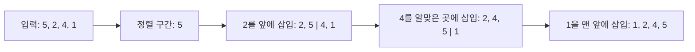
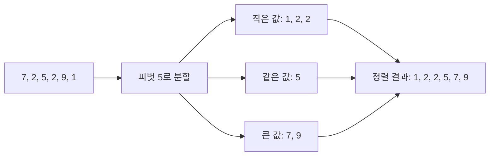
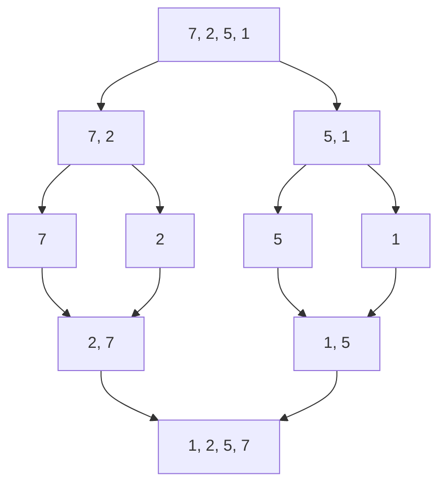
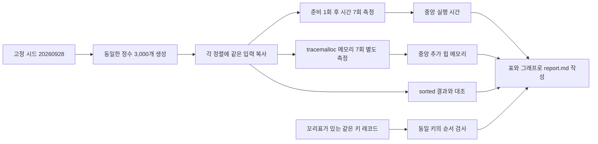
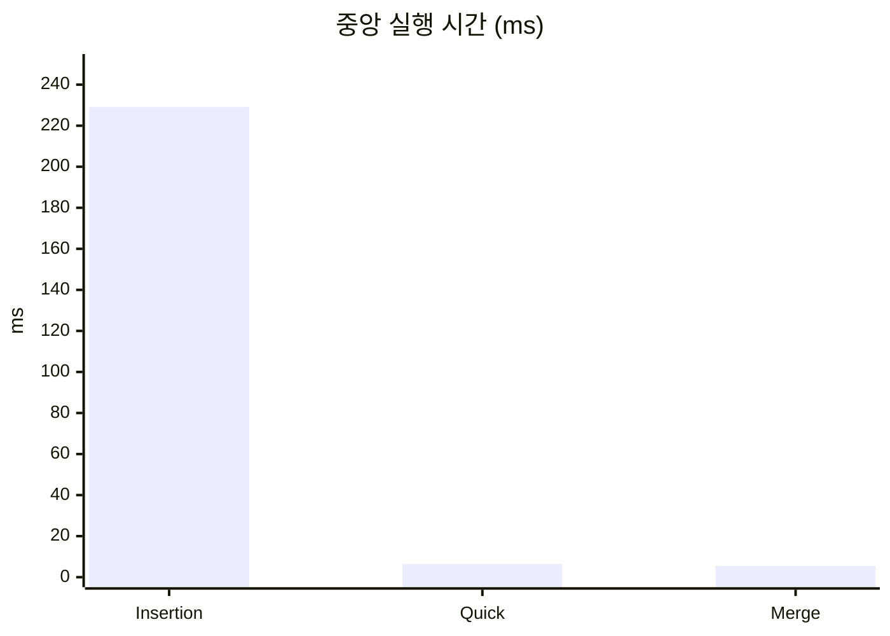
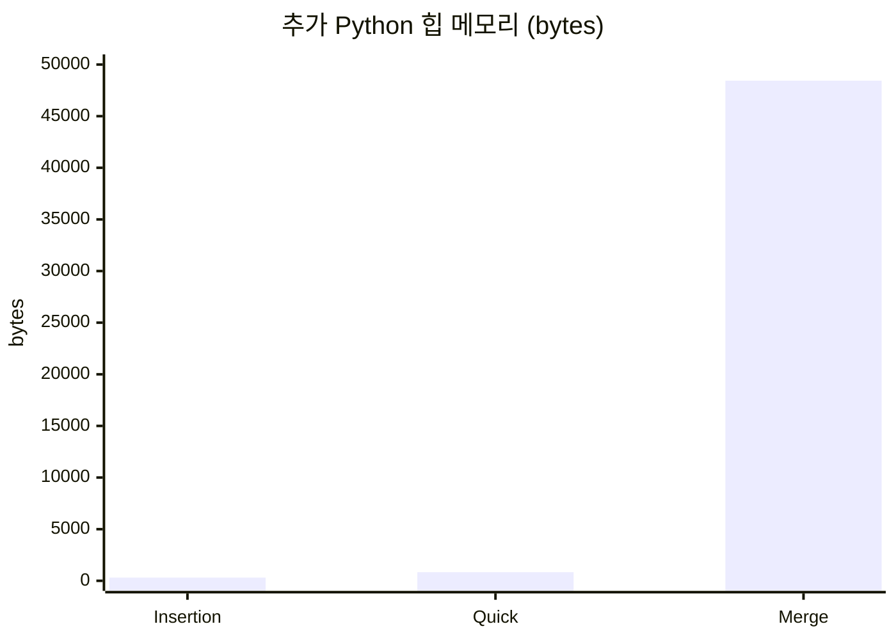

# 정렬 알고리즘 성능 비교 - 삽입, 퀵, 병합

## 알고리즘 설명과 시각화

### 삽입 정렬 (Insertion sort)

왼쪽의 정렬된 구간을 유지하면서 다음 원소를 꺼내, 그보다 큰 원소를 오른쪽으로 옮긴 뒤 빈자리에 삽입한다. 거의 정렬됐거나 원소 수가 적으면 빠르게 동작하지만, 역순에 가까운 입력에서는 이동이 많아진다. 최선은 O(n), 평균·최악은 O(n²)이며 제자리에서 안정적으로 정렬한다.

### 퀵 정렬 (Quick sort)

피벗을 정하고 한 번 훑으면서 작은 값·같은 값·큰 값의 세 구간으로 분할한 뒤, 작은 값과 큰 값 구간을 같은 방식으로 정렬한다. 평균은 O(n log n)이지만 분할이 한쪽으로 치우치면 최악 O(n²)이다. 이 구현은 가운데 원소를 피벗으로 쓰며 제자리 분할을 하지만 안정성은 보장하지 않는다.

### 병합 정렬 (Merge sort)

배열을 반으로 계속 나눠 원소 하나까지 분해한 다음, 이미 정렬된 두 구간을 작은 값부터 골라 합친다. 입력 상태와 무관하게 O(n log n) 시간이 들며, 임시 버퍼를 사용해 O(n) 추가 공간이 필요하다. 같은 키에서는 왼쪽 원소를 먼저 선택하므로 안정 정렬이다.

## 실험 설계

Python 3.13.5 (Linux-6.8.0-1064-azure-x86_64-with-glibc2.41)에서 Python 구현을 비교했다. 시드 `20260928`로 생성한 0 이상 1,000,000 미만의 정수 3,000개를 세 구현에 똑같이 제공했다. 정렬 전 원본을 복사하므로 각 실행은 같은 순서의 입력에서 시작한다.

시간은 준비 실행 1회를 버린 뒤 `time.perf_counter()`로 7회 측정했다. 각 회차의 입력 복사는 타이머 시작 전에 하고, 정렬 함수 호출 직후 타이머를 멈췄다. 정렬 결과가 Python 내장 `sorted()` 결과와 같은지 확인하는 비용은 시간에 포함하지 않았다. 대표값은 평균 대신 중앙값을 사용해 일시적인 스케줄링 지연의 영향을 줄였다.

메모리는 시간 측정과 분리했다. 입력 복사를 먼저 마친 다음 `tracemalloc`을 시작하고, 정렬 도중 기록된 peak에서 시작 시점 메모리를 뺀 값을 7회 구해 중앙값을 썼다. 따라서 표의 값은 Python이 추적하는 추가 힙 메모리이지 프로세스 전체 메모리나 C 구현의 메모리가 아니다.

안정성은 정렬 키가 같은 항목에 서로 다른 꼬리표를 붙인 작은 입력으로 확인했다. 정렬 후 동등 키 항목의 원래 순서를 유지하면 안정, 그렇지 않으면 불안정으로 표시한다. 안정성은 속도·메모리처럼 양으로 측정하는 값이 아니라 동작 특성이다.

## 결과

| 알고리즘 | 시간복잡도 (최선 / 평균 / 최악) | 중앙 시간 (ms) | 추가 Python 힙 (bytes) | 안정성 |
| --- | --- | ---: | ---: | --- |
| Insertion sort | O(n) / O(n²) / O(n²) | 229.150 | 308 | 안정 |
| Quick sort | O(n log n) / O(n log n) / O(n²) | 6.438 | 832 | 불안정 |
| Merge sort | O(n log n) / O(n log n) / O(n log n) | 5.513 | 48436 | 안정 |

### 실행 시간 그래프

### 추가 Python 힙 메모리 그래프

그래프의 세로축은 각각 0부터 시작한다. 삽입 정렬의 시간은 이 입력에서 다른 두 방법보다 훨씬 길어 그래프 막대가 상대적으로 작게 보인다. 메모리 그래프는 Python 추적 힙만 비교하며, 병합 정렬의 선형 버퍼가 크게 나타난다.

## 결과 해석

- 가장 짧은 중앙 실행 시간은 **Merge sort**였고, 가장 적은 추가 Python 힙은 **Insertion sort**였다.
- 삽입 정렬은 추가 버퍼가 거의 없지만, 무작위 3,000개 입력에서 이차 시간 증가가 두드러졌다.
- 퀵 정렬은 보통 적은 추가 공간으로 빠르지만, 최악 시간복잡도가 O(n²)이고 안정 정렬이 아니다.
- 병합 정렬은 O(n log n) 시간을 보장하고 안정적이지만, 임시 버퍼 때문에 추가 메모리가 더 크다.
- 이 수치는 한 환경과 한 종류의 입력에 대한 관측값이다. 입력 분포·크기와 실행 환경이 바뀌면 상대 순위도 달라질 수 있다. `make report`로 다시 측정할 수 있다.

실험을 다시 실행하려면 저장소 루트에서 `make report`를 실행한다.
