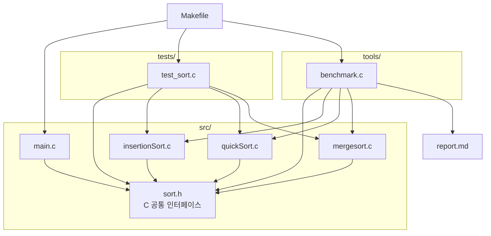
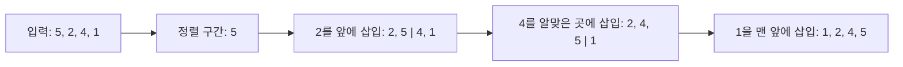
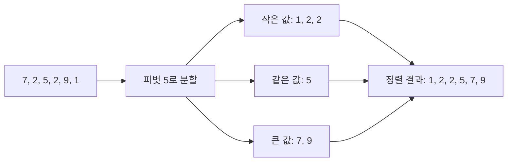
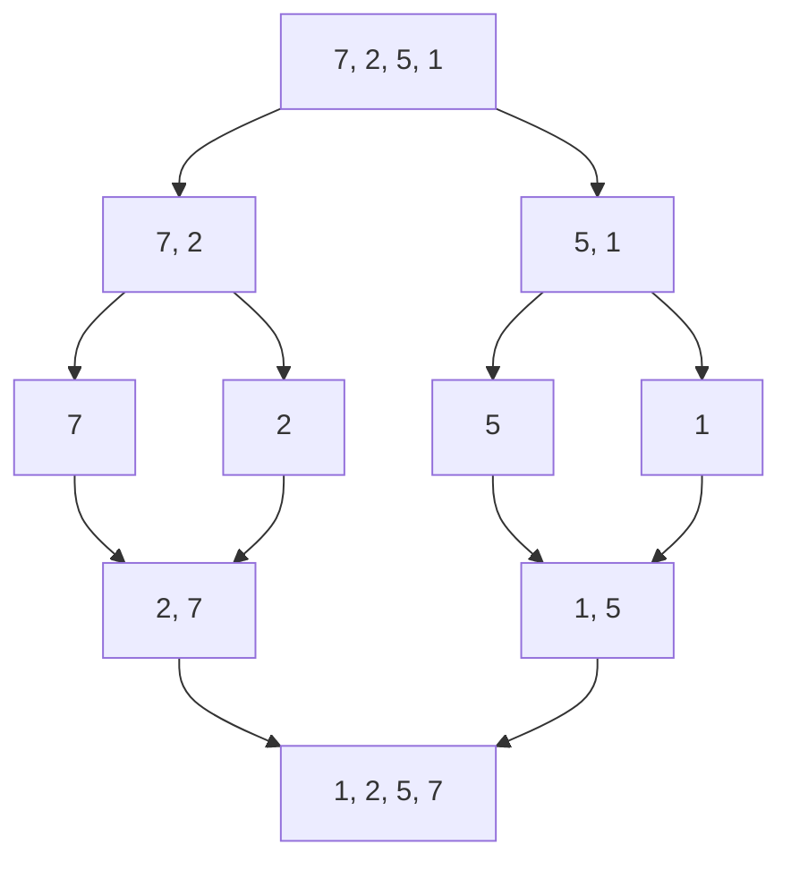
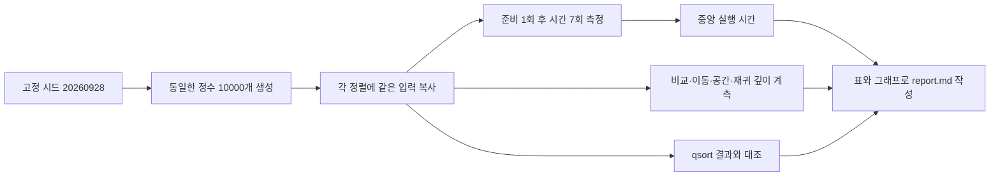
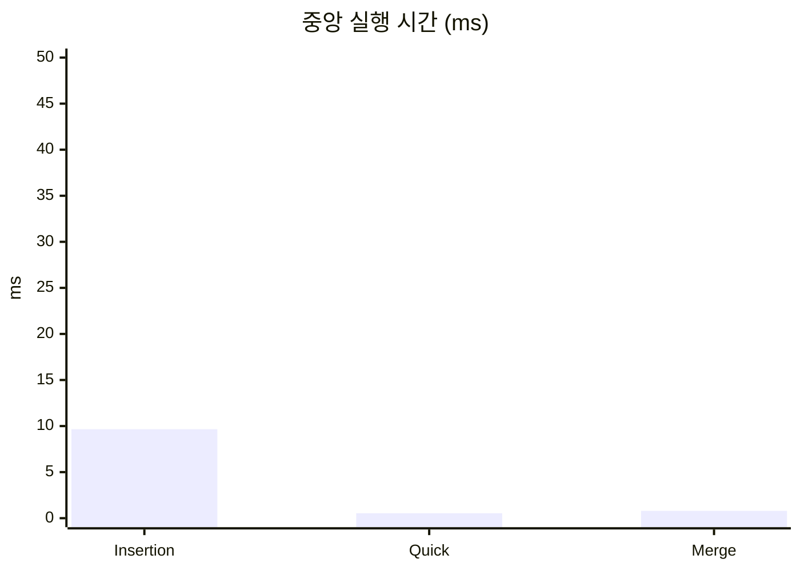
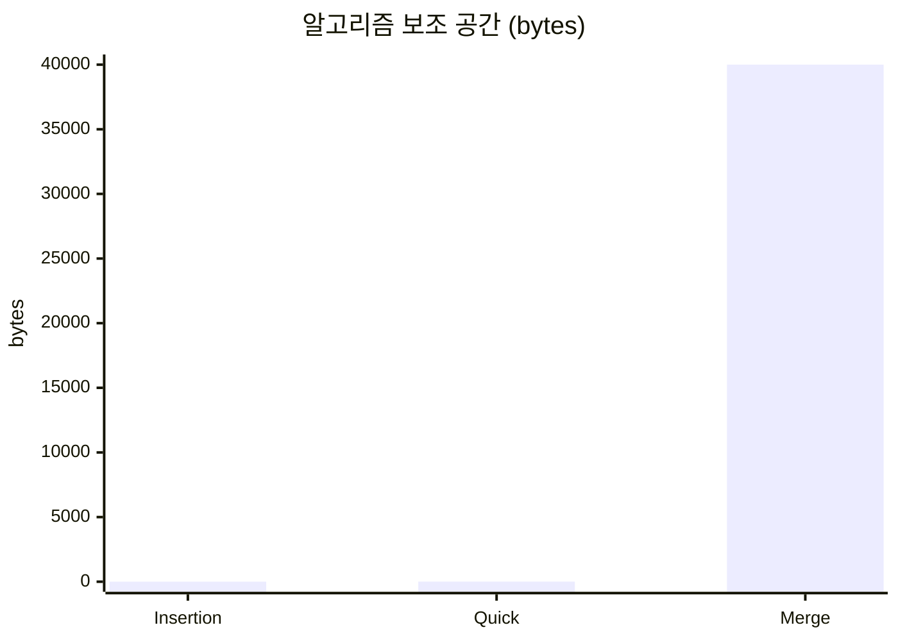

# 정렬 알고리즘 성능 비교

## 차례

1. [코드 보고서](#1-코드-보고서)
2. [알고리즘 상세](#2-알고리즘-상세)
3. [알고리즘 실험](#3-알고리즘-실험)

## 1. 코드 보고서

### 설계 선택과 근거

삽입·퀵·병합 정렬을 C17로 구현해 같은 입력과 측정 조건에서 시간복잡도·비교 및 이동 횟수·보조 공간·재귀 깊이를 비교한다. 세 함수는 공통 인터페이스로 정수 배열을 제자리 오름차순 정렬한다. 외부 라이브러리 없이 표준 C 라이브러리만 사용해 실습 환경에서 바로 빌드하고 실행할 수 있게 했다.

퀵 정렬은 가운데 원소를 피벗으로 삼아 작은 값·같은 값·큰 값으로 세 구간을 나누고, 작은 쪽을 먼저 재귀 호출해 스택 사용을 제한한다. 병합 정렬은 임시 배열을 사용해 안정성을 지키며 O(n log n) 시간을 보장한다.

### 파일 구성

| 파일 | 기능 |
| --- | --- |
| `Makefile` | C 프로그램 빌드·실행·테스트·보고서 생성 |
| `report.md` | 정렬 알고리즘 설명과 C 실험 결과 |
| `src/sort.h` | C 정렬 함수와 통계 구조체의 공통 인터페이스 |
| `src/insertionSort.c` | C 삽입 정렬 구현 |
| `src/quickSort.c` | C 퀵 정렬 구현 |
| `src/mergesort.c` | C 병합 정렬 구현 |
| `src/main.c` | 정렬 실행 예제와 통계 출력 |
| `tools/benchmark.c` | C 정렬 성능 측정 및 `report.md` 생성 |
| `tests/test_sort.c` | 표준 C로 정렬 결과와 통계 검증 |

### 검증 방법

`make test`로 섞인 배열, 정렬된 배열, 역순, 중복 값, 원소 하나, 빈 배열의 결과와 통계 기록을 확인한다. 벤치마크는 측정 결과를 C 표준 라이브러리 `qsort` 결과와 대조해 정렬 정확도를 확인한다. 안정성은 동일 키 처리 순서를 보존하는지 구현의 동작 특성으로 분류한다.

## 2. 알고리즘 상세

### 삽입 정렬 (Insertion sort)

왼쪽의 정렬된 구간을 유지하면서 다음 원소를 꺼내, 그보다 큰 원소를 오른쪽으로 옮긴 뒤 빈자리에 삽입한다. 거의 정렬됐거나 원소 수가 적으면 빠르지만, 역순에 가까운 입력에서는 이동이 많아진다. 최선은 O(n), 평균·최악은 O(n²)이며 제자리에서 안정적으로 정렬한다.

### 퀵 정렬 (Quick sort)

피벗을 기준으로 작은 값·같은 값·큰 값의 세 구간으로 분할한 뒤, 작은 값과 큰 값 구간을 재귀적으로 정렬한다. 평균은 O(n log n)이지만 분할이 한쪽으로 치우치면 최악 O(n²)이다. 가운데 원소를 피벗으로 사용하는 이 구현은 제자리 분할을 하지만 안정성은 보장하지 않는다.

### 병합 정렬 (Merge sort)

배열을 반으로 나눠 원소 하나까지 분해한 다음, 정렬된 두 구간을 작은 값부터 골라 합친다. 입력 상태와 무관하게 O(n log n) 시간이 들며 임시 버퍼로 O(n) 추가 공간을 사용한다. 같은 값에서는 왼쪽 원소를 먼저 선택하므로 안정 정렬이다.

## 3. 알고리즘 실험

같은 C 구현을 같은 고정 입력과 측정 절차로 비교했다. 실행 시간, 연산 횟수, 보조 공간, 재귀 깊이를 표와 그래프로 나타낸다.

### 실험 설계

C17로 빌드한 C 구현을 측정했다. 고정 시드 `20260928`로 0 이상 1,000,000 미만의 정수 10000개를 만들고, 세 정렬에 같은 원본을 제공했다. 각 실행 직전에 복사하므로 모든 측정은 같은 입력에서 시작한다.

준비 실행 1회를 버린 뒤 `clock()`으로 실행 시간을 7회 측정하고 중앙값을 사용했다. 입력 복사는 타이머 시작 전에 했다. 비교·이동 횟수, 보조 공간, 재귀 깊이는 별도 1회 계측에서 얻었다. 보조 공간은 구현이 기록한 알고리즘 보조 메모리이며 입력과 호출 스택은 제외한다. 안정성은 측정값이 아니라 동률 처리 동작으로 판별한다.

### 측정 결과

| 알고리즘 | 시간복잡도 (최선 / 평균 / 최악) | 중앙 시간 (ms) | 비교 횟수 | 이동 횟수 | 보조 공간 (bytes) | 최대 재귀 깊이 | 안정성 |
| --- | --- | ---: | ---: | ---: | ---: | ---: | --- |
| Insertion sort | O(n) / O(n^2) / O(n^2) | 9.657 | 25016266 | 25026278 | 4 | 0 | 안정 |
| Quick sort | O(n log n) / O(n log n) / O(n^2) | 0.541 | 232602 | 441732 | 8 | 8 | 불안정 |
| Merge sort | O(n log n) / O(n log n) / O(n log n) | 0.796 | 120402 | 267232 | 40000 | 15 | 안정 |

### 실행 시간 그래프

### 보조 공간 그래프

실행 시간은 이 환경에서 가장 짧은 중앙값이 **Quick sort**였고, 기록된 보조 공간이 가장 적은 알고리즘은 **Insertion sort**였다. 삽입 정렬은 무작위 입력에서 이차 시간 증가가 나타나며, 병합 정렬은 선형 보조 공간을 사용한다. 이 결과는 한 입력 크기와 실행 환경의 관측값이며, 입력 분포와 환경에 따라 달라질 수 있다.

실험을 다시 실행하려면 저장소 루트에서 `make report`를 실행한다.
