# 정렬 비교 보고서 - 삽입 · 버블 · 트리
세 가지 정렬을 **하나의 공통 인터페이스**로 묶고, 같은 잣대로 속도, 보조 메모리, 안정성, 비교 횟수, 입력 정렬 정도별 성능 등을 비교한 결과이다.

- 구현: [`src/insertionSort.c`](../src/insertionSort.c) ·
  [`src/quickSort.c`](../src/quickSort.c) · [`src/tree_sort.c`](../src/tree_sort.c)
- 실행: `make run` (비교 표) · `make test` (유닛 테스트 42개)
- 환경: 컨테이너 안 `gcc -std=c17 -Wall -Wextra -O2`

## 차례

1. [코드 보고서](#1-코드-보고서) - 무엇을 어떻게 만들었나
2. [알고리즘 상세](#2-알고리즘-상세) - 세 정렬이 실제로 어떻게 행동하는가
3. [알고리즘 실험](#3-알고리즘-실험) - 같은 잣대로 비교한 결과

## 1. 코드 보고서

### 1.1 설계 선택과 근거

삽입·퀵·tree sort를 C17로 구현해 같은 입력과 측정 조건에서 시간복잡도·비교 및 이동 횟수·보조 공간·재귀 깊이를 비교한다. 세 함수는 공통 인터페이스로 정수 배열을 제자리 오름차순 정렬한다. 외부 라이브러리 없이 표준 C 라이브러리만 사용해 실습 환경에서 바로 빌드하고 실행할 수 있게 했다.

### 1.2 인터페이스 설계

인터페이스를 먼저 정한 이유는 **정렬 알고리즘의 차이만 공정하게 비교**하기 위해서이다. 세 알고리즘이 서로 다른 방식으로 입력을 받거나 결과를 내면 실행·테스트·측정 코드도 각자 달라져 비교 기준이 흔들릴 수 있다.
그래서 sort.h에서 함수 형식, 제자리 오름차순 정렬, 통계 전달 방식을 통일했다. 그러면,
1) 같은 입력을 같은 절차로 각각 실행할 수 있다
2) 알고리즘을 바꿔도 테스트와 벤치마크 코드를 거의 바꾸지 않아도 된다.

**인터페이스 설계에서 선택한 것**

| 선택한 것 | 선택 이유 |
| --- | --- |
| `typedef void (*SortFunction)(int a[], int n, SortStats *stats)` | 세 정렬을 같은 함수 포인터 형식으로 호출해 실행 예제·테스트·벤치마크에서 알고리즘별 어댑터가 필요 없게 한다. |
| 입력 배열을 오름차순으로 제자리 정렬하고 반환값은 두지 않음 | 별도 결과 배열을 만들지 않아도 되고, 출력 계약을 모든 구현에서 동일하게 유지한다. |
| `SortStats *`를 선택 인자로 전달하고 `NULL`을 허용 | 통계가 필요한 실행에서는 비교·이동·보조 공간·재귀 깊이를 기록하고, 시간 측정에서는 계측 비용을 끌 수 있다. |
| `SortFunction` 함수 포인터로 공통 타입 정의 | 정렬 함수들을 배열에 담아 같은 입력·검사·측정 절차로 반복 실행할 수 있다. |
| 길이 `n`을 호출자가 전달 | 포인터와 배열 길이를 명시해 빈 배열도 `n = 0`으로 처리하고, 구현이 길이를 추정하지 않게 한다. |


### 1.3 파일 구성

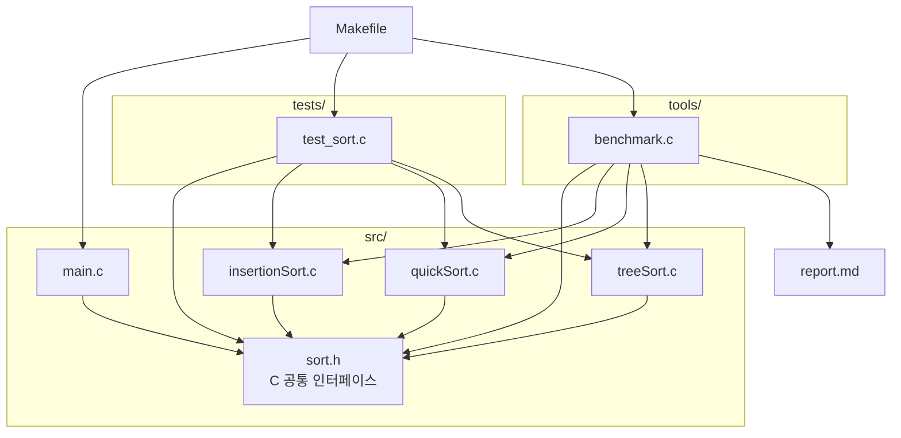

| 파일 | 기능 |
| --- | --- |
| `Makefile` | C 프로그램 빌드·실행·테스트·보고서 생성 |
| `report.md` | 정렬 알고리즘 설명과 C 실험 결과 |
| `src/sort.h` | C 정렬 함수와 통계 구조체의 공통 인터페이스 |
| `src/insertionSort.c` | C 삽입 정렬 구현 |
| `src/quickSort.c` | C 퀵 정렬 구현 |
| `src/treeSort.c` | 이진 탐색 트리를 만들고 중위 순회로 정렬하는 tree sort |
| `src/main.c` | 정렬 실행 예제와 통계 출력 |
| `tools/benchmark.c` | C 정렬 성능 측정 및 `report.md` 생성 |
| `tests/test_sort.c` | 표준 C로 정렬 결과와 통계 검증 |

### 1.4 검증 방법

```console
$ make test
```

1. **빌드·링크**: `make test`가 `tests/test_sort.c`와 세 정렬 구현을 빌드한 뒤 테스트를 실행한다.
2. **정렬 결과**: 섞임·정렬됨·역순·중복·원소 하나·빈 배열을 세 알고리즘에 적용해 총 18개 결과를 비교한다.
3. **통계 기록**: 세 정렬에 `{3, 1, 2}`를 넣어 정렬 결과와 비교·이동·보조 공간 카운터 기록 여부를 확인한다.
4. **정렬 정답**: 각 실험 입력을 `qsort` 결과와 대조하며, 불일치하면 실행을 실패 처리한다.
5. **시간 측정**: 준비 실행 후 복사를 제외하고 7회 재며, 중앙값을 사용한다. 연산·공간 통계는 별도로 잰다.
6. **안정성**: 레코드 순서를 직접 시험하지 않고, 같은 값의 순서를 보존하는지 구현의 동률 처리로 판별한다.

**변이 테스트**
: 실제 코드는 그대로 두고 `/tmp` 복사본에 결함을 넣어 테스트가 검출하는지 확인했다.

| 망가뜨린 곳 | 결과 |
| --- | --- |
| Tree sort에서 중복 원소 개수 증가 제거 | 중복 입력 검사 실패 (21개 중 1개, 종료 코드 1) |
| Tree sort에서 오른쪽 하위 트리 순회 생략 | 통계·섞인 배열·중복 입력 검사 실패 (21개 중 3개, 종료 코드 1) |

## 2. 알고리즘 상세

### 2.1 삽입 정렬 (Insertion sort)

왼쪽의 정렬된 구간을 유지하면서 다음 원소를 꺼내, 그보다 큰 원소를 오른쪽으로 옮긴 뒤 빈자리에 삽입한다. 거의 정렬됐거나 원소 수가 적으면 빠르지만, 역순에 가까운 입력에서는 이동이 많아진다. 최선은 O(n), 평균·최악은 O(n²)이며 제자리에서 안정적으로 정렬한다.

핵심은 현재 값을 보관하고, 그보다 큰 앞쪽 원소만 오른쪽으로 밀어 빈자리에 삽입하는 것이다.

```c
int value = a[i];
int j = i - 1;
while (j >= 0 && a[j] > value) {
    a[j + 1] = a[j];
    j--;
}
a[j + 1] = value;
```

`>` 조건은 같은 값은 지나치지 않으므로 입력 순서를 유지한다.

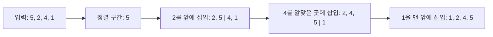

### 2.2 퀵 정렬 (Quick sort)

피벗을 기준으로 작은 값·같은 값·큰 값의 세 구간으로 분할한 뒤, 작은 값과 큰 값 구간을 재귀적으로 정렬한다. 평균은 O(n log n)이지만 분할이 한쪽으로 치우치면 최악 O(n²)이다. 가운데 원소를 피벗으로 사용하는 이 구현은 제자리 분할을 하지만 안정성은 보장하지 않는다.

`less`, `scan`, `greater` 경계로 작은 값·미확인 값·큰 값을 나누며 한 번의 순회로 피벗 기준 세 구간을 만든다.

```c
while (scan <= greater) {
    if (a[scan] < pivot) {
        int tmp = a[less];
        a[less++] = a[scan];
        a[scan++] = tmp;
    } else if (a[scan] > pivot) {
        int tmp = a[greater];
        a[greater--] = a[scan];
        a[scan] = tmp;
    } else {
        scan++;
    }
}
```

작은 값은 왼쪽으로, 큰 값은 오른쪽으로 보낸다. 큰 값과 바꿔 온 원소는 아직 확인하지 않았으므로 `scan`을 그대로 둔다.

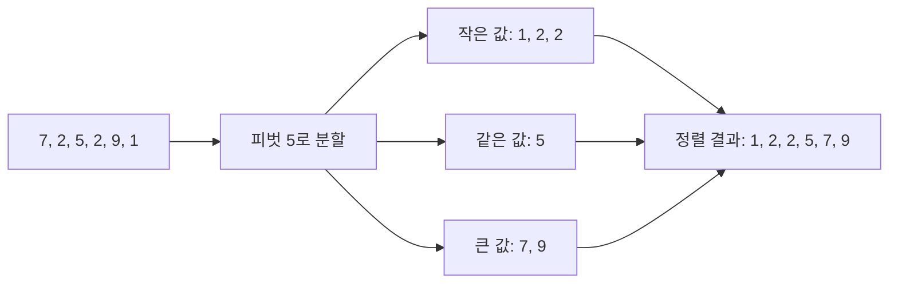

### 2.3 트리 정렬 (Tree sort)
트리 정렬의 내용은 AI(chatGPT)를 사용해서 학습하였다. 아래 내용은 트리 정렬에 대해서 학습한 내용이다.

입력 원소를 이진 탐색 트리에 삽입한 뒤, 중위 순회(left → node → right) 결과를 배열에 다시 써 오름차순으로 만든다. 이 구현은 반복형 삽입과 반복형 순회를 사용해 트리가 한쪽으로 기울어도 호출 스택이 깊어지지 않게 한다. 같은 정수는 새 노드를 만들지 않고 해당 노드의 `occurrences`를 증가시킨다.

#### 선수 개념: 이진 탐색 트리란
이진 탐색 트리는 각 노드가 값과 왼쪽·오른쪽 자식을 갖는 구조다. 왼쪽 하위 트리에는 노드보다 작은 값, 오른쪽 하위 트리에는 큰 값을 둔다. 같은 값은 새 노드 대신 기존 노드의 `occurrences`에 센다.

예를 들어 `7, 2, 9, 1, 5, 8, 5`를 차례로 삽입하면 다음 구조가 된다. 두 번째 5는 새 노드를 만들지 않고 기존 5의 개수에 합친다.

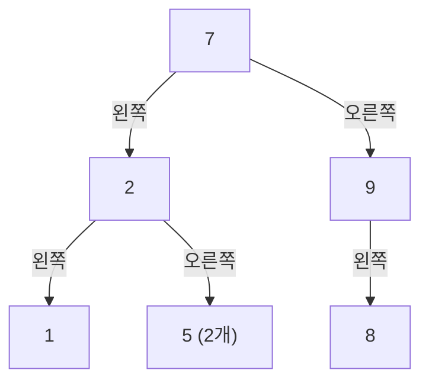

#### 1단계: 이진 탐색 트리 구성

각 값은 현재 노드보다 작으면 왼쪽, 크면 오른쪽으로 내려간다. 같은 값이면 개수만 늘린다. 노드를 만들 때까지 이 과정을 반복한다.

```c
while (*link != NULL) {
    if (value < (*link)->value) link = &(*link)->left;
    else if (value > (*link)->value) link = &(*link)->right;
    else { (*link)->occurrences++; break; }
}
```

노드 삽입 순서에 따라 트리 모양이 달라진다. 균형이 잘 맞으면 각 삽입이 짧은 경로를 따라가지만, 이미 정렬된 입력은 계속 같은 방향의 자식으로만 연결돼 긴 사슬이 될 수 있다.

#### 2단계: 반복형 중위 순회

스택에 왼쪽 경로를 저장했다가 가장 작은 노드부터 꺼낸다. 노드를 꺼낼 때 `occurrences`만큼 값을 출력 배열에 기록하고, 오른쪽 하위 트리로 이동한다.

```c
while (current != NULL || stack_size > 0) {
    while (current != NULL) {
        stack[stack_size++] = current;
        current = current->left;
    }
    current = stack[--stack_size];
    writeValue(current->value, current->occurrences);
    current = current->right;
}
```

`writeValue`는 동작을 보여 주기 위한 축약 표현이며, 실제 구현은 반복문으로 해당 값을 `occurrences`번 배열에 쓴다. 트리 구성이 끝날 때까지 원본 배열을 수정하지 않으므로 노드나 스택 할당에 실패하면 입력은 그대로 남는다.

#### 복잡도·공간·안정성

노드 삽입 비용은 트리 높이를 `h`라 할 때 O(nh), 중위 순회는 O(n)이다. 균형 트리에서는 높이가 O(log n)이므로 평균적인 시간은 O(n log n)이지만, 입력 순서가 오름차순 또는 내림차순이면 높이가 O(n)이 되어 최악 시간은 O(n²)이다. 노드와 순회 스택을 저장하므로 추가 공간은 O(n)이다. 중복을 개수로 합치고 원래 순서는 저장하지 않으므로 안정 정렬은 아니다.

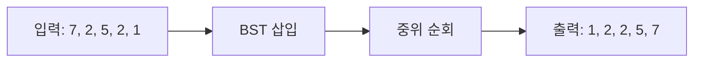

## 3. 알고리즘 실험

같은 C 구현을 같은 고정 입력과 측정 절차로 비교했다. 실행 시간, 연산 횟수, 보조 공간, 재귀 깊이를 표와 그래프로 나타낸다.

### 3.1 실험 설계

모든 구현은 컨테이너의 `gcc -std=c17 -Wall -Wextra -O2` 환경에서 측정했다.

| 무엇을 재는가 | 방법 | 주의사항 |
| --- | --- | --- |
| 실행 시간 | 3.2.1의 입력 모양별 n=2,000 및 3.2.2의 무작위 n=1,000~8,000을 측정한다. 각 조건은 3회 실행해 중앙값을 쓴다. | 배열 복사와 정답 확인은 시간에서 제외한다. 한 컴파일러·환경에서 얻은 값이다. |
| 정렬 정확도 | 각 입력을 `qsort`한 결과와 알고리즘의 정렬 결과를 대조한다. | 확인 비용은 실행 시간에 포함하지 않으며, 불일치하면 실행을 실패 처리한다. |
| 비교·이동 횟수 | 별도 실행에서 `SortStats` 카운터를 읽는다. | 구현이 정한 연산 단위의 카운트이며 실제 CPU 명령 수는 아니다. |
| 보조 메모리 | 각 구현이 `SortStats.auxiliary_bytes`에 기록한 값을 읽는다. | 입력 배열과 호출 스택은 제외한다. Tree sort의 노드와 순회 스택은 포함한다. |
| 재귀 깊이 | 별도 계측 실행에서 `max_recursion_depth`를 읽는다. | 재귀 호출 깊이만 뜻한다. 반복형 Tree sort에서는 트리 높이를 나타내지 않는다. |
| 입력 모양 | n=2,000에서 무작위·정렬·역순·중복 다수 입력을 비교하고, 무작위 크기는 1,000·2,000·4,000·8,000으로 늘린다. | 입력 모양별 표와 크기별 표는 서로 다른 실험 조건이다. |
| 작은 배열 시간·교차점 | 무작위 배열 크기 1~128을 모두 측정하고, 같은 크기의 여러 배열을 묶어 배열당 중앙 시간을 낸다. | 이 측정은 별도 C 벤치마크의 7회 반복이며, 교차점은 5개 연속 크기 우세를 기준으로 한다. |
| 안정성 | 같은 키에서 원래 순서를 보존하는지 구현의 동률 처리로 판별한다. | 정수 전용 테스트라 꼬리표가 있는 레코드로 직접 측정하지 않는다. |

#### 안정성을 어떻게 판별했는가

안정 정렬은 정렬 키가 같은 항목들의 입력 순서를 정렬 후에도 보존한다. 직접 시험할 때는 같은 키의 항목에 입력 순서를 나타내는 꼬리표를 붙인다. 예를 들어 `[(2,A), (1,X), (2,B)]`를 첫 값 기준으로 정렬했을 때 `A`가 `B`보다 앞에 있으면 안정이다. 이번 테스트 인터페이스는 정수만 받으므로 이 검사를 직접 실행하지 않고 구현의 동률 처리 방식으로 판별했다.

| 알고리즘 | 동률 처리 방식 | 판별 |
| --- | --- | --- |
| Insertion sort | 앞의 값이 현재 값과 같으면 이동을 멈춰 입력 순서를 유지한다. | 안정 |
| Quick sort | 분할 중 원소를 교환하므로 같은 키 항목의 상대 순서가 바뀔 수 있다. | 불안정 |
| Tree sort | 같은 값을 `occurrences`로 합쳐 항목별 입력 순서를 저장하지 않는다. | 불안정 |

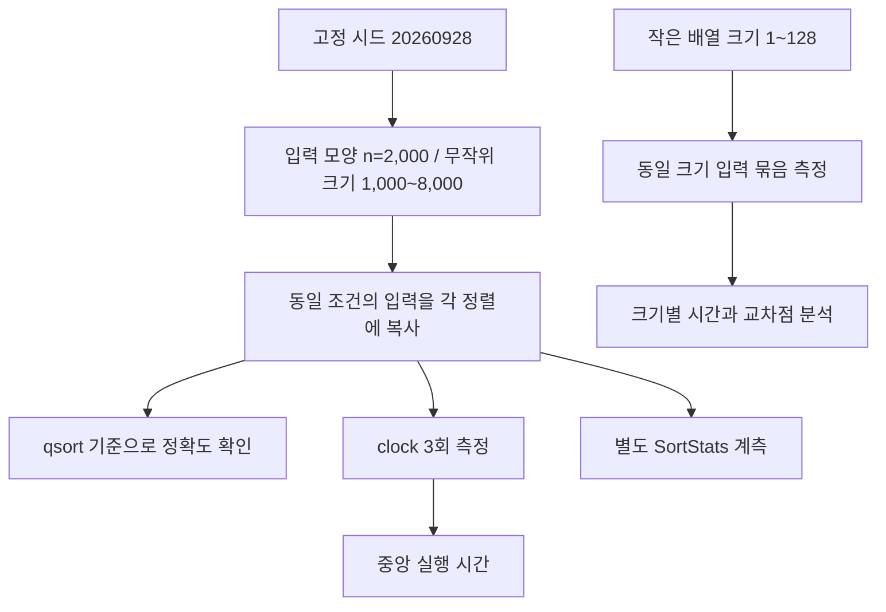
### 3.2 실험 결과

#### 무작위 입력 요약 (n=2,000)

아래 표는 3.2.1의 무작위 입력 행과 같은 n=2,000 측정 결과를 시간복잡도·안정성 정보와 함께 정리한 것이다. 별도 입력이나 측정을 추가하지 않았다.

| 알고리즘 | 시간복잡도 (최선 / 평균 / 최악) | 중앙 시간 (ms) | 비교 횟수 | 이동 횟수 | 보조 공간 (bytes) | 최대 재귀 깊이 | 안정성 |
| --- | --- | ---: | ---: | ---: | ---: | ---: | --- |
| Insertion sort | O(n) / O(n^2) / O(n^2) | 0.780 | 1002746 | 1004755 | 4 | 0 | 안정 |
| Quick sort | O(n log n) / O(n log n) / O(n^2) | 0.111 | 39273 | 74872 | 8 | 7 | 불안정 |
| Tree sort | O(n) / O(n log n) / O(n^2) | 0.263 | 23622 | 2000 | 79880 | 0 | 불안정 |

#### 선형축과 로그축을 모두 보면 좋은 이유
두 축을 같이 보면 **절대 차이와 상대 차이**를 모두 볼 수 있다.

- 선형축은 값의 실제 크기와 차이를 직관적으로 보여준다. 다만 큰 값이 있으면 작은 값들이 바닥에 붙어 차이가 잘 안 보일 수 있다.
- 로그축은 값의 비율과 자릿수 차이를 비교하기 좋다. 큰 값과 작은 값이 함께 있는 그래프에서도 작은 값들 사이의 차이가 드러난다. 다만 막대 높이를 절대량으로 해석하면 안 되고, 0은 로그축에 표현할 수 없다.

### 3.2.1 입력 모양별 결과 (n=2000)

입력 크기는 2,000개다. 고정 시드 무작위 값, 오름차순, 내림차순, 0~7 사이 값만 사용하는 중복 다수 입력을 비교했다. 시간 단위는 ms이고 보조 공간은 bytes다.

| 입력 모양 | 알고리즘 | 시간 (ms) | 비교 횟수 | 이동 횟수 | 보조 공간 (B) | 최대 재귀 깊이 |
| --- | --- | ---: | ---: | ---: | ---: | ---: |
| 무작위 | Insertion | 0.780 | 1,002,746 | 1,004,755 | 4 | 0 |
| 무작위 | Quick | 0.111 | 39,273 | 74,872 | 8 | 7 |
| 무작위 | Tree | 0.263 | 23,622 | 2,000 | 79,880 | 0 |
| 정렬됨 | Insertion | 0.009 | 1,999 | 3,998 | 4 | 0 |
| 정렬됨 | Quick | 0.045 | 30,664 | 60,080 | 8 | 9 |
| 정렬됨 | Tree | 3.721 | 1,999,000 | 2,000 | 80,000 | 0 |
| 역순 | Insertion | 1.497 | 1,999,000 | 2,002,998 | 4 | 0 |
| 역순 | Quick | 0.056 | 30,494 | 59,577 | 8 | 9 |
| 역순 | Tree | 3.992 | 1,999,000 | 2,000 | 80,000 | 0 |
| 중복 다수 | Insertion | 0.699 | 877,747 | 879,748 | 4 | 0 |
| 중복 다수 | Quick | 0.015 | 10,250 | 12,758 | 8 | 2 |
| 중복 다수 | Tree | 0.014 | 5,742 | 2,000 | 320 | 0 |

아래 네 지표는 각각 선형축과 로그축으로 그렸다. 로그축은 작은 값과 큰 값의 차이를 함께 보기 위한 것이며, 값이 0인 재귀 깊이는 축 기준선에 표시한다.

#### 실행 시간

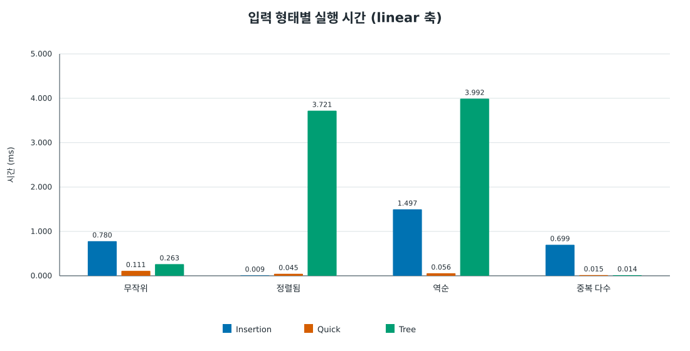

선형축에서는 정렬·역순 입력에서 Tree sort의 실행 시간이 크게 두드러진다. 무작위 입력에서는 Quick sort가 가장 짧고, 중복 다수 입력에서는 Quick과 Tree sort가 비슷하게 짧다.

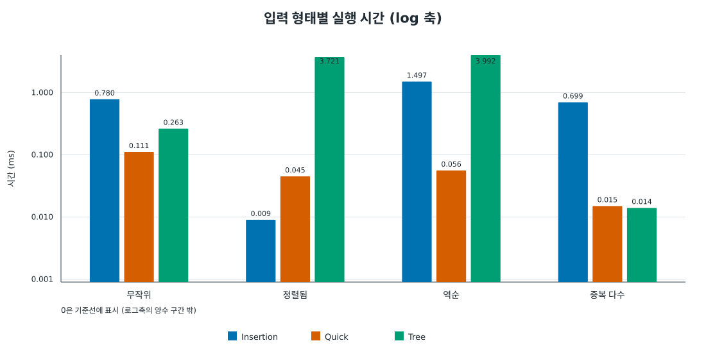

로그축에서는 작은 시간 차이도 비교하기 쉽다. Insertion sort는 이미 정렬된 입력에서 가장 짧으며, Tree sort는 정렬·역순 입력에서만 크게 느려지는 입력 민감성이 드러난다.

#### 비교 횟수

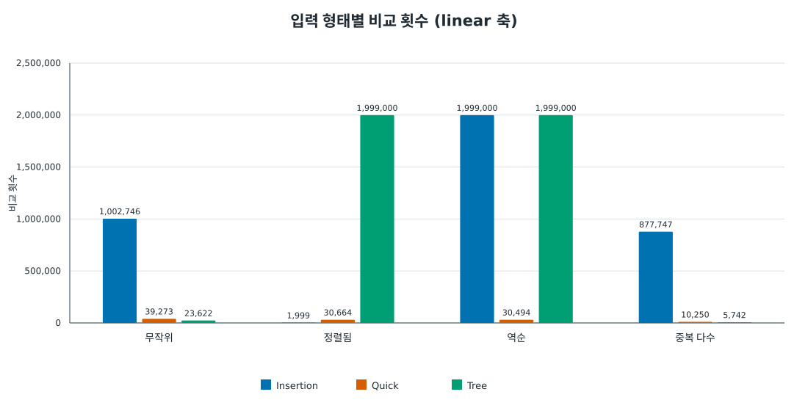

역순 입력의 Insertion sort와 정렬·역순 입력의 Tree sort가 약 200만 회로 가장 큰 비교 횟수를 보인다. 이 값들이 선형축 범위를 차지해 다른 입력에서의 차이는 상대적으로 작게 보인다.

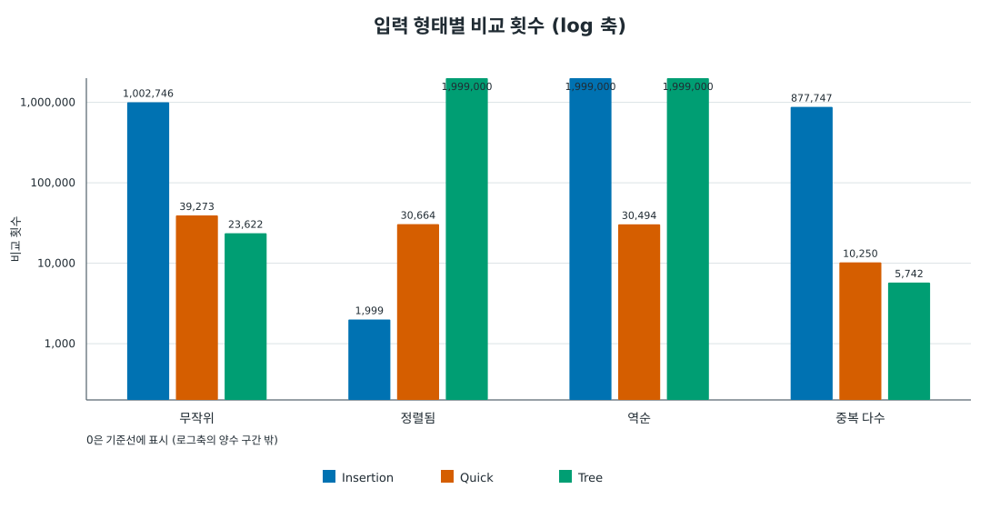

로그축에서는 정렬 입력에서 Insertion sort가 1,999회만 비교하는 반면 Tree sort는 1,999,000회 비교하는 차이와, 무작위·중복 입력에서 알고리즘별 격차를 함께 볼 수 있다.

#### 이동 횟수

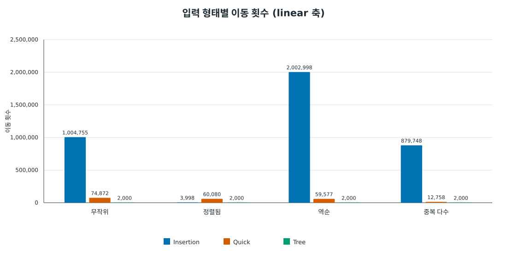

역순 입력의 Insertion sort가 약 200만 회 이동해 가장 크다. Tree sort는 입력 모양과 관계없이 배열 원소 수인 2,000회 이동으로 일정하다.

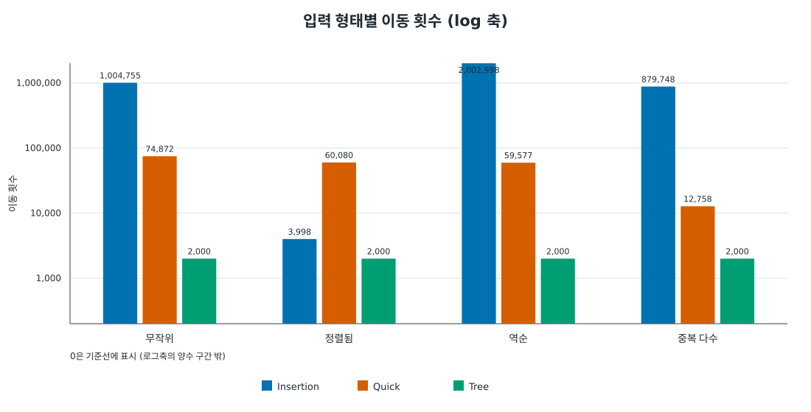

로그축에서는 Tree sort의 2,000회와 Insertion·Quick sort의 수만~수백만 회 이동 차이가 잘 드러난다. 중복 다수 입력에서는 Quick sort의 이동 횟수도 크게 줄어든다.

#### 재귀 깊이

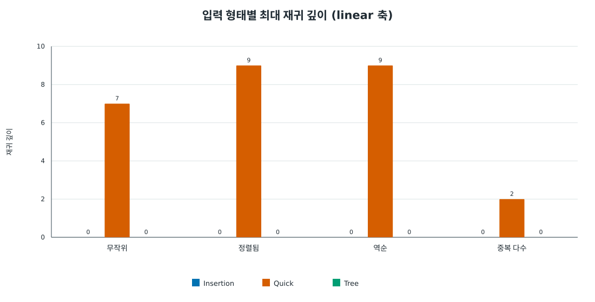

기록된 재귀 깊이는 Quick sort에서만 2~9이며, 정렬·역순 입력에서 9로 가장 깊다. 반복형 Insertion·Tree sort는 모든 입력에서 0이다.

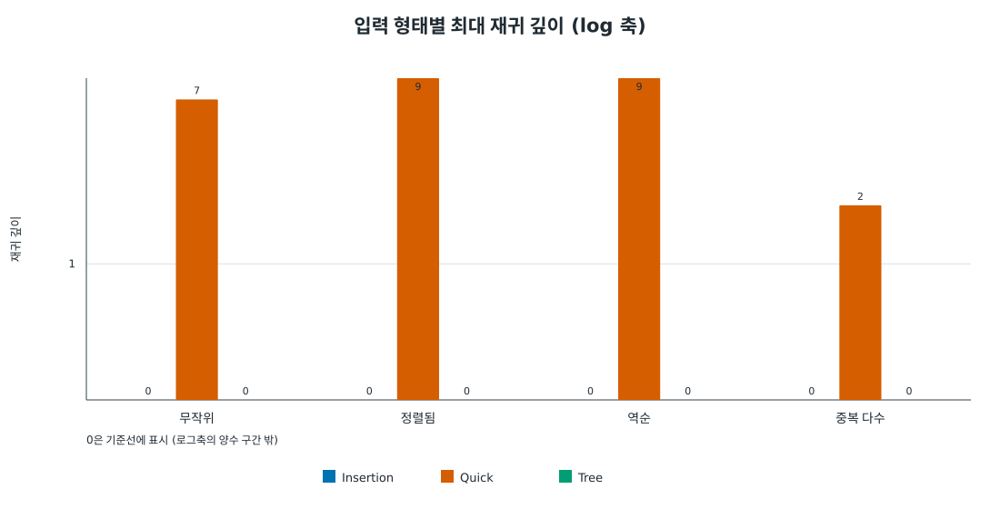

양수 값의 로그축에서도 Quick sort는 정렬·역순 입력의 깊이 9가 가장 크고 중복 다수 입력에서는 2로 얕다. 0인 Insertion·Tree sort 값은 로그축에 놓을 수 없어 기준선에 표시된다.

### 3.2.2 무작위 입력 크기별 결과

고정 시드로 생성한 무작위 입력의 크기를 1,000개에서 8,000개까지 두 배씩 늘렸다. 아래 표는 실행 시간과 연산 통계를 함께 보여 준다.

| 원소 수 | 알고리즘 | 시간 (ms) | 비교 횟수 | 이동 횟수 | 보조 공간 (B) | 최대 재귀 깊이 |
| ---: | --- | ---: | ---: | ---: | ---: | ---: |
| 1,000 | Insertion | 0.197 | 254,001 | 255,010 | 4 | 0 |
| 1,000 | Quick | 0.048 | 17,992 | 33,611 | 8 | 6 |
| 1,000 | Tree | 0.110 | 10,449 | 1,000 | 39,960 | 0 |
| 2,000 | Insertion | 0.778 | 1,002,746 | 1,004,755 | 4 | 0 |
| 2,000 | Quick | 0.115 | 39,273 | 74,872 | 8 | 7 |
| 2,000 | Tree | 0.235 | 23,622 | 2,000 | 79,880 | 0 |
| 4,000 | Insertion | 3.135 | 4,053,536 | 4,057,546 | 4 | 0 |
| 4,000 | Quick | 0.246 | 92,233 | 173,430 | 8 | 8 |
| 4,000 | Tree | 0.450 | 52,495 | 4,000 | 159,800 | 0 |
| 8,000 | Insertion | 10.977 | 15,982,180 | 15,990,191 | 4 | 0 |
| 8,000 | Quick | 0.591 | 195,268 | 358,540 | 8 | 8 |
| 8,000 | Tree | 1.478 | 115,813 | 8,000 | 318,800 | 0 |

비교 횟수와 실행 시간은 각각 선형축·로그축 그래프로 비교했다.

#### 비교 횟수

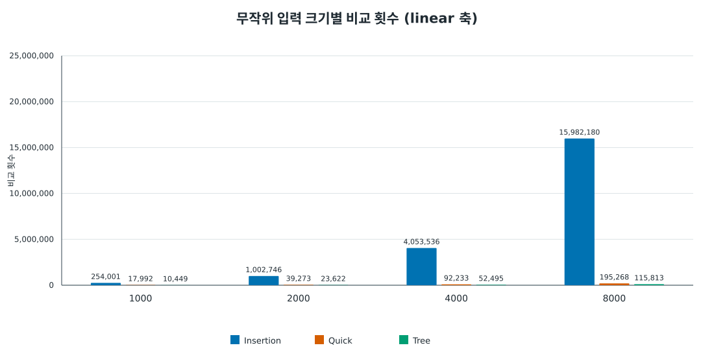

크기가 커질수록 Insertion sort의 비교 횟수가 가파르게 늘어 8,000개에서 약 1,598만 회에 이른다. Tree sort는 네 입력 크기 모두에서 세 알고리즘 중 비교 횟수가 가장 적다.

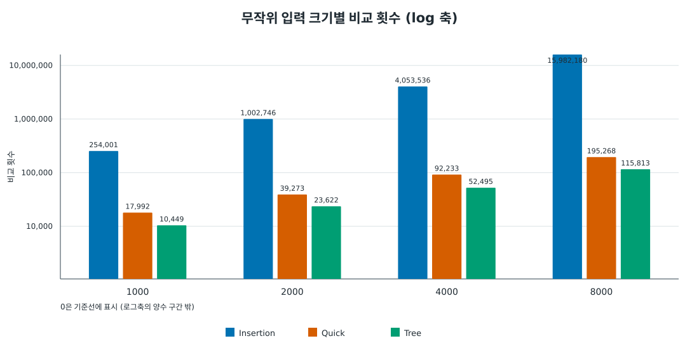

로그축에서는 세 알고리즘의 성장 추세를 함께 읽을 수 있다. Insertion sort의 증가 폭이 가장 크고, Quick·Tree sort는 그보다 완만하며 Tree sort가 계속 더 적은 비교를 한다.

#### 실행 시간

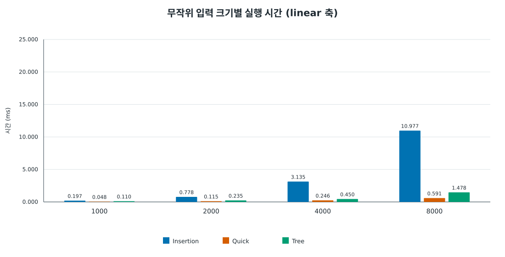

네 입력 크기 모두 Quick sort가 가장 짧은 시간이다. 8,000개에서 Insertion sort는 약 10.98 ms, Tree sort는 1.48 ms, Quick sort는 0.59 ms로 벌어진다.

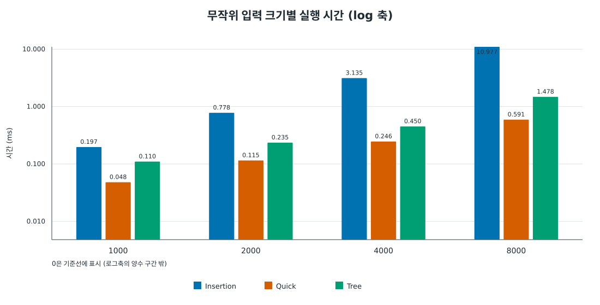

로그축에서도 입력 크기 증가에 따른 시간 상승이 세 알고리즘 모두에서 확인되며, Quick sort와 Insertion sort 간 격차는 크기가 커질수록 확대된다. Tree sort는 두 알고리즘 사이의 시간을 보인다.

Insertion sort는 무작위 입력 크기가 커지면서 비교 횟수와 시간이 빠르게 증가했다. 이번 측정에서는 Quick sort가 1,000~8,000개 구간에서 가장 짧은 시간이었고, 정렬되거나 역순인 입력에서 Tree sort의 비교 횟수가 크게 증가했다. 결과는 이 컴파일러·환경과 고정 입력 생성 방식에서의 관측값이다.

재실행은 저장소 루트에서 `make run`을 실행한다. CSV와 그래프는 매번 갱신된다.


### 3.2.3 보조 공간 그래프

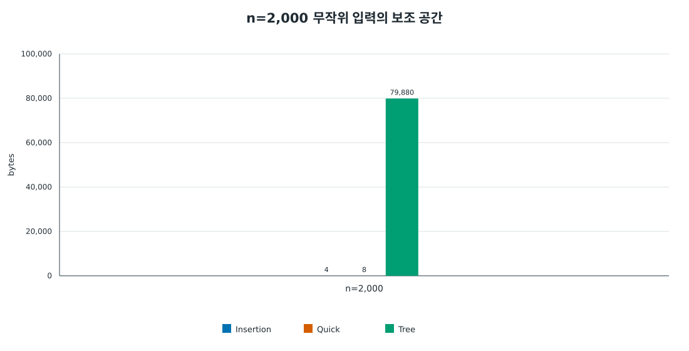

세 값은 프로세스 전체 메모리가 아니라 구현이 `SortStats.auxiliary_bytes`에 기록한 보조 저장 공간이다. Insertion sort는 임시 정수 한 개(4 B), Quick sort는 이 구현의 계측 기준인 정수 두 개(8 B)를 기록한다. Quick sort의 재귀 호출 스택은 포함되지 않는다. Tree sort는 고유한 입력 값마다 할당한 노드와 순회 스택 배열을 합산한다. n=2,000 무작위 입력에서는 고유 값 1,997개가 있어 노드 32 B와 포인터 8 B를 합한 `1,997 × 40 = 79,880 B`로 기록됐다. 입력 배열, `malloc` 관리 정보, 호출 스택은 제외되므로 실제 실행 중 메모리 사용량과는 다른 비교 지표다.


### 3.2.4 작은 배열의 성능과 교차점

무작위 정수 입력의 크기를 1개부터 128개까지 1개씩 늘려 측정했다. 표와 그래프는 대표 크기를 보여 주며, 교차점 탐색은 모든 크기 측정값을 사용한다. 시간은 배열 한 개당 중앙값(µs)이다.

각 크기마다 고정 시드 `20260928`로 만든 무작위 배열을 기준 입력으로 삼고, 정렬 결과를 `qsort` 결과와 대조한다. 짧은 정렬은 `clock()`의 시간 해상도에 묻히기 쉬워 같은 입력 배열 여러 개를 연속 정렬해 묶음 시간을 잰다. 묶음 수는 대략 전체 원소 수가 4,096개 이상이 되도록 `4096 / n`으로 정하고, 최소 32개 배열을 사용한다. 준비 실행 1회 후 7회 측정하며 복사와 정답 검사는 측정 구간 밖에 둔다. 묶음 시간을 배열 수로 나눠 배열 한 개당 시간으로 환산하고, 7개 측정치의 중앙값을 기록한다. 표와 그래프에는 대표 크기 1, 2, 4, …, 128만 표시하지만 교차점 판정에는 1~128의 모든 측정값을 쓴다.

| 원소 수 | Insertion (µs) | Quick (µs) | Tree (µs) |
| ---: | ---: | ---: | ---: |
| 1 | 0.0024 | 0.0022 | 0.0034 |
| 2 | 0.0054 | 0.0088 | 0.0332 |
| 4 | 0.0078 | 0.0205 | 0.0596 |
| 8 | 0.0195 | 0.0371 | 0.1387 |
| 16 | 0.0547 | 0.0820 | 0.3047 |
| 32 | 0.2578 | 0.4609 | 1.2109 |
| 64 | 0.5625 | 0.5156 | 1.5000 |
| 128 | 2.4375 | 1.6875 | 3.2500 |

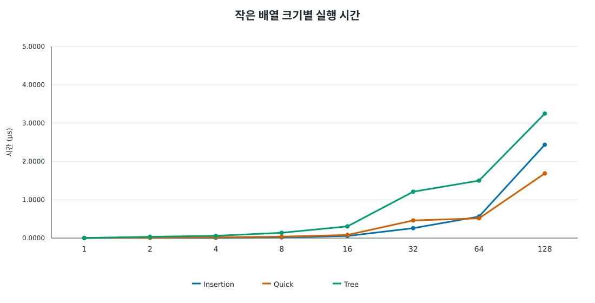

선 색상은 파랑=Insertion sort, 주황=Quick sort, 초록=Tree sort 순서다.

#### 소형 배열 교차점

초기 우세는 2–6개 구간의 평활 시간 중앙값으로, 큰 배열 쪽 우세는 126–128개 구간의 평활 시간 중앙값으로 판별한다. 두 구간의 승자가 다르면 큰 배열 쪽 알고리즘이 5개 연속 크기에서 처음 더 빨라지는 크기를 교차점으로 기록한다. 각 크기의 평활 시간은 인접한 최대 5개 크기 측정값의 중앙값이다.

구체적으로는 각 크기와 그 양옆 최대 2개 크기의 시간 중앙값을 계산해 측정 흔들림을 줄인다. 2~6개 구간에서 작은 쪽 승자를, 126~128개 구간에서 큰 쪽 승자를 정한 뒤, 승자가 달라질 때 큰 쪽 승자가 처음으로 5개 연속 크기에서 모두 빠른 시작 크기를 찾는다. Insertion–Quick의 64는 이 조건을 처음 만족한 시작 크기이므로 한 지점에서만 우연히 시간이 역전된 경우는 교차로 세지 않는다.

Insertion–Tree는 두 끝 구간 모두 Insertion sort가, Quick–Tree는 두 끝 구간 모두 Quick sort가 더 빨라 교차 탐색을 시작하지 않는다. 그러므로 표의 “지속 교차 없음”은 양 끝 구간에서 승자가 같다는 뜻이며, 중간 크기에서 일시적으로 순위가 바뀌지 않았다는 보증은 아니다. 교차점은 이 입력과 환경에서 얻은 경험값이므로 다른 환경의 임계 크기로 일반화할 수 없다.

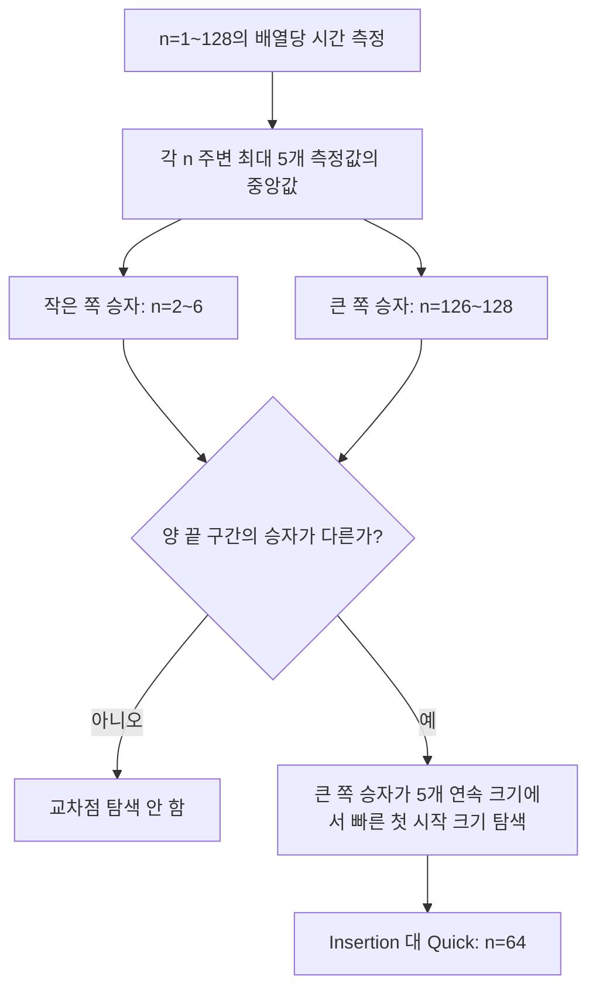

도식의 `n=64`는 Insertion sort보다 Quick sort가 다섯 크기 연속으로 빨라지는 조건을 처음 만족한 시작 크기다.

| 알고리즘 쌍 | 측정된 교차점 |
| --- | --- |
| Insertion ↔ Quick | 64개부터 Quick sort가 Insertion sort보다 5개 연속 크기에서 빠름 |
| Insertion ↔ Tree | 1–128개에서 지속 교차 없음 (Insertion sort가 양 끝 구간에서 우세) |
| Quick ↔ Tree | 1–128개에서 지속 교차 없음 (Quick sort가 양 끝 구간에서 우세) |

소형 입력은 측정 시간의 해상도 영향을 줄이기 위해 같은 크기의 배열 여러 개를 한 묶음으로 정렬했다. 복사와 결과 확인은 시간 측정 구간에서 제외했다.

3.2.1의 무작위 n=2,000 입력에서는 **Quick sort**가 가장 짧은 시간(0.111 ms)을 보였고, 기록된 보조 공간은 **Insertion sort**가 가장 작았다(4 B). 입력 모양에 따라 이미 정렬된 배열에서는 Insertion sort가, 중복 다수에서는 Quick·Tree sort가 빠른 결과를 보였다. 입력 크기를 1,000~8,000으로 늘린 실험에서도 Quick sort가 가장 짧은 시간을 유지했고, 작은 배열에서는 대체로 Insertion sort가 유리하다가 64개부터 Quick sort가 연속 우세 기준을 만족했다. 메모리·안정성은 Insertion sort가 O(1) 공간의 안정 정렬, Quick sort가 O(log n) 호출 스택의 불안정 정렬, Tree sort가 O(n) 공간의 불안정 정렬로 요약된다. 이 결과는 사용한 입력과 실행 환경에 한정된 관측값이다.

### 3.2.5 알고리즘별 메모리와 안정성

아래 메모리 계측값은 3.2.1의 무작위 n=2,000 입력에 대해 각 구현이 `SortStats.auxiliary_bytes`에 기록한 값이다. 점근적 추가 공간은 입력 배열을 제외한 알고리즘의 추가 저장 공간을 나타낸다.

| 알고리즘 | 추가 공간 복잡도 | 계측된 보조 공간 (n=2,000) | 안정성 | 판단 근거 |
| --- | --- | ---: | --- | --- |
| Insertion sort | O(1) | 4 B | 안정 | 앞의 값이 현재 값보다 클 때만 이동하므로 같은 값의 입력 순서를 유지한다. |
| Quick sort | O(log n) 호출 스택 | 8 B* | 불안정 | 분할 중 교환으로 같은 값의 상대 순서가 바뀔 수 있다. |
| Tree sort | O(n) | 79,880 B | 불안정 | 같은 값을 개수로 합치며 항목별 원래 순서를 저장하지 않는다. |

`*` Quick sort의 8 B는 구현이 계측하는 임시 정수 두 개의 크기다. 재귀 호출 스택은 이 바이트 수에 포함되지 않지만, 점근적 추가 공간 O(log n)에는 포함된다. Tree sort의 계측값은 고유 값별 노드와 순회 스택 배열의 합이며 할당기 관리 정보는 제외한다. 안정성은 정수만 처리하는 인터페이스에서 꼬리표를 붙인 레코드로 직접 시험하지 않고, 같은 키를 처리하는 구현 방식으로 판별했다.

### 3.2.6 전체 실험 결과 요약

실험에서는 입력 형태와 크기에 따라 알고리즘의 우세가 달라졌다. 3.2.1의 무작위 n=2,000 입력에서는 Quick sort가 가장 짧은 시간(0.111 ms)을 보이고, Insertion sort는 계측 보조 공간이 가장 작았다(4 B). 같은 크기의 입력 모양별 비교에서 이미 정렬된 배열은 Insertion sort가, 중복 다수 입력은 Quick·Tree sort가 빠르게 정렬했다. 3.2.2의 무작위 입력 크기 n=1,000~8,000에서도 Quick sort가 가장 짧은 시간을 유지했으며, 작은 배열에서는 대체로 Insertion sort가 유리하다가 64개부터 Quick sort가 연속 우세 기준을 만족했다. 메모리·안정성은 Insertion sort가 O(1) 공간의 안정 정렬, Quick sort가 O(log n) 호출 스택의 불안정 정렬, Tree sort가 O(n) 공간의 불안정 정렬로 요약된다. 이 결과는 사용한 입력·측정 환경에 한정된 관측값이다.

실험 입력 결과와 SVG 그래프를 다시 생성하려면 저장소 루트에서 `make run`을 실행한다.
